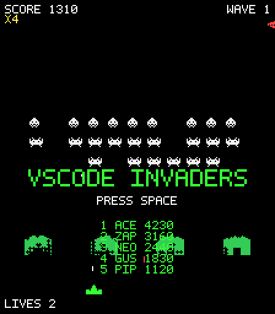

# 👾 VSCode Invaders

Version: 1.1.0

A Space Invaders–inspired arcade game playable right inside VS Code. 100%
procedural — every sprite, sound, and effect is generated in code. No assets,
no network, no telemetry. Just a brain reload between compiles.

## Play

- Click the **👾 rocket** in the status bar, or
- Run **`VSCode Invaders: Play`** from the Command Palette (`⇧⌘P` / `Ctrl+Shift+P`).

While the game panel is open, the status bar item becomes a **mute/unmute
button** and always reflects the real sound state.

## Controls

| Key | Action |
|---|---|
| `←` / `→` or `A` / `D` | Move |
| `Space` | Fire (also starts a game) |
| `P` / `Esc` | Pause |
| `M` | Mute / unmute |

Keys are only captured while the game panel is focused — your editor
keybindings are never touched. The game auto-pauses when you switch tabs.

## The game

The classic fixed-shooter loop, with modern tweaks:

- **The march** — the formation speeds up as invaders die, and the audio
  heartbeat accelerates in lockstep.
- **Destructible bunkers** that erode shot by shot, per pixel.
- **Mystery UFO** for bonus points; every 5th wave is a UFO bonus round.
- **Power-ups** dropped by glowing invaders: `RAPID` fire, `SPREAD` triple
  shot, `SHIELD`, and `FREEZE` (the heartbeat stops too — eerie).
- **Divers** that kamikaze out of formation and **armored** invaders that take
  two hits, from wave 3.
- **Streak scoring** — consecutive hits build a ×1→×4 multiplier; a miss
  resets it.
- **Arcade-style high scores** — enter your 3 initials, top 10 persisted and
  synced via Settings Sync.
- **CRT effects** — scanlines, phosphor glow, vignette. All synthesized audio
  via Web Audio; all sprites procedural pixel bitmaps.

Extra life every 10,000 points. Invaders reaching the bottom is game over.

## Settings

| Setting | Default | Description |
|---|---|---|
| `vsCodeInvaders.sound` | `true` | Master audio on/off |
| `vsCodeInvaders.crtEffect` | `"full"` | CRT post-processing: `full`, `scanlines`, or `off` |
| `vsCodeInvaders.palette` | `"classic"` | `classic` (phosphor + cellophane zone tint) or `neon` |
| `vsCodeInvaders.statusBarLauncher` | `true` | Show the 👾 status bar item |
| `vsCodeInvaders.openBeside` | `false` | Open the game panel in a split editor column |

All settings apply live — no reload needed.

## Commands

| Command | |
|---|---|
| `VSCode Invaders: Play` | Open (or reveal) the game panel |
| `VSCode Invaders: Show High Scores` | Top 10 leaderboard |
| `VSCode Invaders: Reset High Scores` | Wipe the leaderboard (asks first) |

## Privacy

High scores live in VS Code `globalState` on your machine (synced only by your
own Settings Sync). The webview loads no remote content and makes no network
requests.

---

*Inspired by classic fixed-shooter arcade games. All art and audio are
original and generated procedurally.*

Made with ❤️ by Sudeep Hazra
